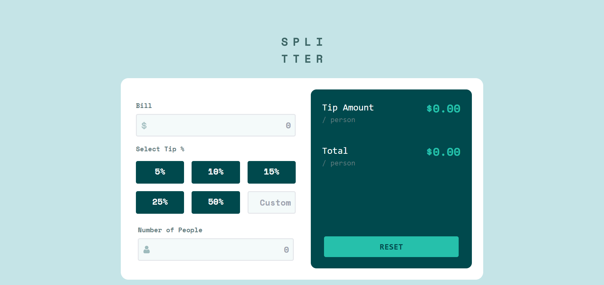
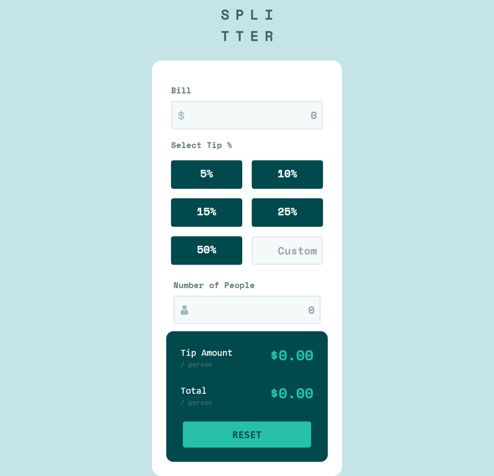

# Frontend Mentor - Tip calculator app

## Welcome! 👋

Thanks for checking out this front-end coding challenge. 
## The challenge

Your challenge is to build out this tip calculator app and get it looking as close to the design as possible.

## Built with
- HTML5
- Tailwind CSS
- JavaScript

## Preview images

<kbd></kbd>
<kbd></kbd>

**Have fun building!** 🚀
